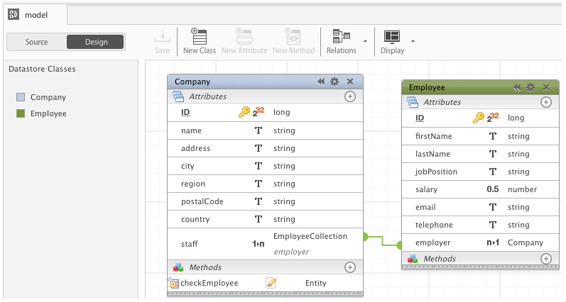

---
---

<header>
<h1>Design your data model</h1>
</header>

## 1. Open your model

Double-click the model file in your project’s database folder (as shown below) or click on the  button to access your project’s model.

## 2. Add classes and attributes

Add classes and attributes to your data model directly in the Data Model Editor (as shown below) or by using the [Datastore API](http://doc.wakanda.org/home2.en.html/Datastore/Datastore.100-588923.en.html){:target="_blank"}. Once you have designed your data model, save it.

For more information about designing a data model, refer to the [Datastore Model](http://doc.wakanda.org/home2.en.html#/User-Guide/Datastore-Model.200-1102147.en.html){:target="_blank"} chapter in the Wakanda Studio User Guide.

---

After designing your data model, you can prototype your app and start adding data to make sure that the data model corresponds to your needs.

[Prototype your app »](prototype.html)
